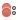

=====================================
Conditional Breakpoints and Animation
=====================================

We have a game window with a label, but nothing is moving. Boring!

Let's see how to do animation in Arcade. Our label will start at an initial
position, then each time ``update`` is called, we'll move it to the right.
To make this more clear, we'll also update the string displayed in the label,
to include the position.

Along the way, we'll look at more features in debugger breakpoints.

Objectives
==========

- Conditional breakpoints

- Suspend all breakpoints

- Clear all breakpoints

- Break on exceptions

Steps
=====

#. Terminate the game, if it is running. (Remember: |terminate|)

#. Edit ``game.py`` to have the following:

   .. literalinclude:: game.py
        :language: python
        :linenos:
        :emphasize-lines: 9, 13-15, 17-18

   - *Line 9*. We will constantly update the position of the label, so
     let's initialize it with a starting position.

   - *Line 13*. Center the text on the screen height.

   - *Line 14-15*. Use Python 3.6 f-strings to make a label and draw it to
     the middle of the screen. Note that this is going to change every time
     line 18 updates the position.

   - *Line 18*. Move the position one pixel to the right. This gets called
     "a lot" by Arcade (where "a lot" can be configured.) ``delta_time`` is
     how long it has been since ``update`` was last called.

#. *Run under debugger*. Make sure there are no breakpoints |breakpoint|
   and click the green button (either on line 27 or in the debug window)
   to run it under the debugger, just to see what it looks like.

#. *Set first breakpoint*. What's ``delta_time``? Let's take a look. Set a
   breakpoint |breakpoint| on line 18 (``self.position``). Execution stops
   immediately and ``delta_time`` is a fraction of a second.

#. *Resume*. Click |resume| to continue execution, which stops immediately
   at the same breakpoint. The ``delta_time`` value is much bigger. Why?
   Because we were paused in the debugger and Arcade couldn't do the next
   ``update`` call.

#. *Set conditional breakpoint*. Let's stop execution, but only when the
   text is halfway across the screen. Right-click on the breakpoint
   |breakpoint| image on line 18. In the ``Condition`` box, enter
   ``self.position > 300`` and click ``Done`` to close the popup.

#. *Re-run*. Click the ``Debug`` window's re-run button |rerun| to stop
   and restart the application.

#. *Program runs, then stops*. The label moves across the screen a bit,
   then the program stops and the debugger takes over. What's the value
   of ``self.position``? Expand the triangle for ``self`` and take a look.
   (Pro tip: zoom down through a long list by typing ``posi``.)

#. *Resume*. Click |resume| and you'll see that execution immediately
   stops again. ``self.position`` is now ``302``. Keep clicking
   |resume| and watch the value go up.

#. *Shut up the breakpoints*. Perhaps, for a moment, we don't want any
   breakpoints in use. In the debug window, click mute breakpoints |mute|
   to briefly turn them off. Click resume |resume| and the label starts
   moving again. Turn off muting by clicking |mute| and execution
   immediately stops.

#. *Clear your breakpoints*. As your sleuthing, you can pile up breakpoints
   and forget where they are. Click view breakpoints |view| to bring up
   a dialog of all your set breakpoints. Select any breakpoints in
   ``game.py``, then click the minus button and ``Done``. Your breakpoints
   are gone.

#. *Unhandled exception*. PyCharm has a built-in breakpoint to stop on all
   unhandled exceptions. Let's put in an error on line 15, changing
   ``message`` to ``y`` as the first ``draw_text`` argument.

#. *Re-run*. Your code changed, so in the debug window, click re-run to
   stop and restart.

#. *Execution stops*. Deep in Arcade, in ``document.py``, we have a line
   that fails because a string was expected (``message``) and we sent a
   number (``y``).

#. *Stop on Exceptions*. What controls this? Click view breakpoints |view|
   and look at ``Any Exception`` under the ``Python Exception Breakpoint``
   heading.

#. *Terminate*. Click the red square |terminate| and close ``document.py``.

What's Going On
===============

In this step we're going further into breakpoints, showing some of the
features that make them much more practical.

For example, conditional breakpoints solve a practical problem in debugging.
Often you want to stop execution, but only when a certain threshold is
reached. Click |resume| a hundred times to reach some threshold would...suck.
In fact, in some cases, the time window for the threshold might be miniscule.
Having a conditional breakpoint is a big time saver for debugging.

Same for suspending breakpoints. As you work through debugging a problem, you
might want to go back, temporarily, to seeing your code without all the
breakpoints. It would be painful to remove all the breakpoints, then re-add
them.

But sometimes you *do* want to clear all your breakpoints, especially if
you have set them deep in some library that you can't remember visiting.

Finally, "stop on exceptions" helps when debugging the problems in other
people's code, where it can be cumbersome to find the line and set the
breakpoint.

.. |breakpoint| image:: ../images/db_set_breakpoint.png

.. |mute| image:: ../images/debug_mute_breakpoints.png
.. |resume| image:: ../images/debug_resume.png
.. |debug| image:: ../images/debug.png
.. |terminate| image:: ../images/stop.gif
.. |rerun| image:: ../images/stop_and_rerun.png
